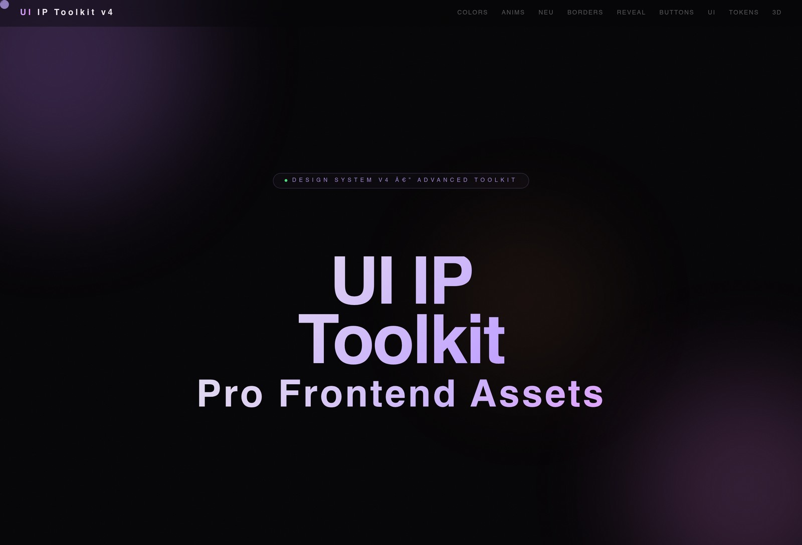
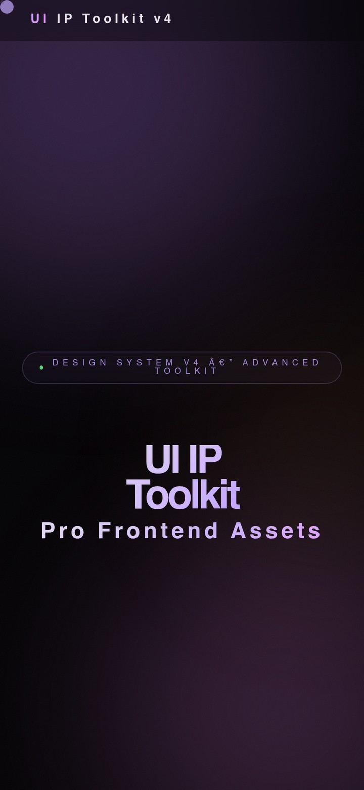

# UI IP Toolkit v4

UI IP Toolkit is a public-ready static showcase for premium frontend assets, motion patterns, design tokens, UI references, and copyable HTML/CSS snippets.

Production site: https://ui-ip-toolkit.vercel.app/

<p align="center">
  <a href="https://ui-ip-toolkit.vercel.app/">
    
  </a>
  
</p>

## Overview

This repository packages the entire experience as a single static deployment with zero backend requirements. It is designed to be easy to publish, safe to expose publicly, and simple to inspect or extend.

Core scope:

- Single-page static interface with 30 sections and 200+ copyable elements.
- Visual coverage across buttons, cards, forms, gradients, motion studies, 3D patterns, framework-inspired references, and design tokens.
- Local browser interactions for copy-to-clipboard, pagination, cursor effects, reveal animations, and synthesized audio demos.
- Vercel-ready deployment with hardened response headers and a restrictive Content Security Policy.

## Live Demo

- Public URL: https://ui-ip-toolkit.vercel.app/
- Hosting target: Vercel static deployment
- Runtime profile: no backend, no database, no remote media dependencies

## Highlights

- Zero runtime dependencies on third-party CDNs or media hosts.
- Static asset delivery from `self` with CSP hashes for the remaining inline demo handlers.
- Public-safe metadata and repository configuration for open-source hosting.
- Desktop and mobile-friendly presentation from the same static artifact.

## Security Profile

- `Content-Security-Policy`, `Referrer-Policy`, `Permissions-Policy`, `X-Content-Type-Options`, `X-Frame-Options`, `Cross-Origin-Opener-Policy`, and `Cross-Origin-Resource-Policy` are defined in [vercel.json](vercel.json).
- Runtime scripts are served locally from [assets/app.js](assets/app.js).
- Audio interactions are synthesized in-browser instead of loading external audio files.
- The package is marked `private` to avoid accidental registry publication.
- No application secrets are required for local preview or production delivery.

## Project Structure

```text
.
|- assets/
|  \- app.js
|- docs/
|  \- images/
|     |- readme-desktop.jpg
|     \- readme-mobile.jpg
|- index.html
|- package.json
|- README.md
\- vercel.json
```

## Local Development

Open [index.html](index.html) directly in a browser, or serve the directory locally:

```bash
npm start
```

The start script uses a lightweight static server and exposes the site on `http://127.0.0.1:3333`.

## Deployment

This repository is prepared for static deployment on Vercel. The live production target is:

- https://ui-ip-toolkit.vercel.app/

Deployment behavior:

- `main` is the public branch.
- Vercel serves the static site directly from the repository root.
- Cache policy is conservative for HTML and long-lived for versioned static assets.

## Public Metadata

- Canonical URL and social preview metadata are defined in [index.html](index.html).
- Project homepage metadata is defined in [package.json](package.json).
- README screenshots are stored locally in the repository so documentation does not depend on remote image hosts.

## License

MIT. See [LICENSE](LICENSE).
