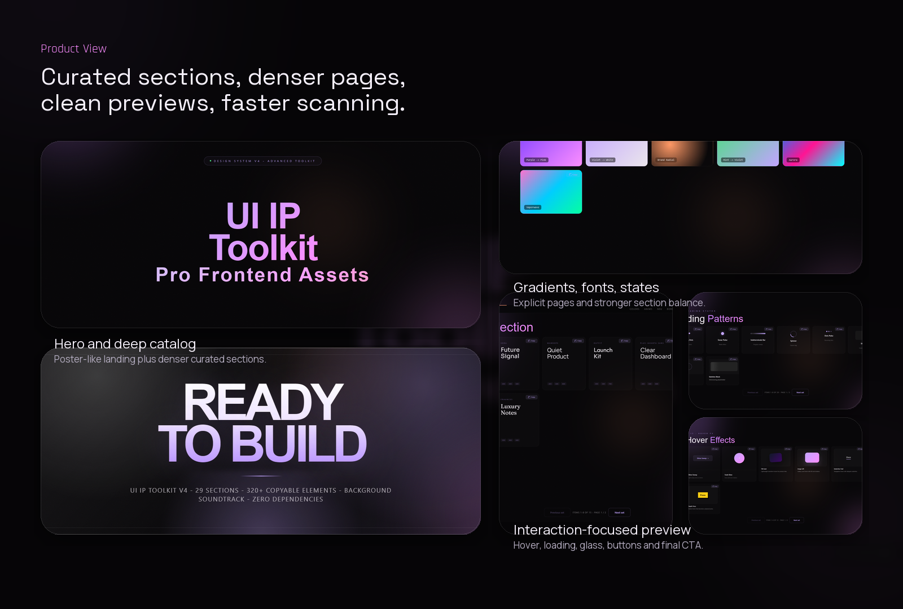
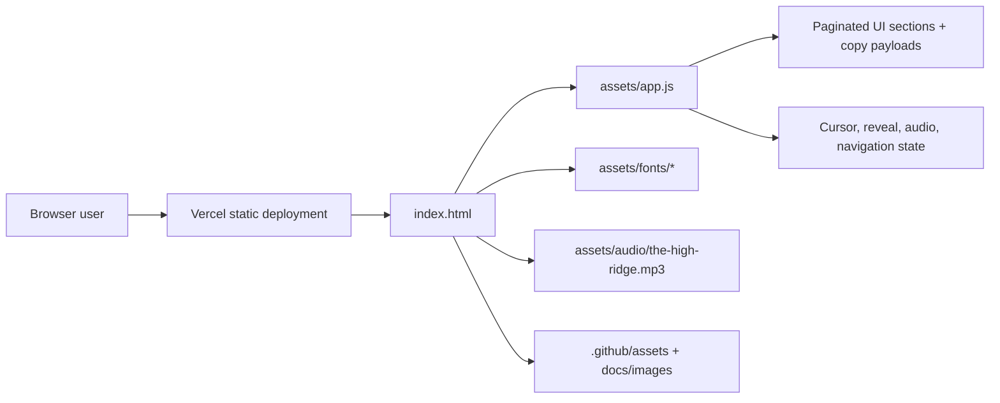

# UI IP Toolkit

<p align="center">
  <a href="https://ui-ip-toolkit.vercel.app/"><strong>ui-ip-toolkit web</strong></a>
  |
  <a href="#quick-start"><strong>Run Locally</strong></a>
  |
  <a href="#accessibility-and-quality"><strong>Accessibility</strong></a>
  |
  <a href="#architecture"><strong>Architecture</strong></a>
</p>

<p align="center">
  
  
  
  
</p>

UI IP Toolkit is a public-facing static catalog of copy-ready frontend assets: gradients, buttons, fonts, loading states, hover treatments, glass surfaces, layout fragments, and reusable product UI patterns. It is designed to feel like a polished product library rather than a loose code dump, while remaining safe to publish and trivial to deploy on Vercel.

## Preview

<p align="center">
  
</p>

<p align="center">
  
</p>

## Highlights

- Poster-style landing page with dense sectioned browsing and explicit pagination instead of endless oversized grids.
- Expanded visual systems across color tokens, curated gradients, keyframe patterns, typography, buttons, loading states, text effects, shadows, hover effects, glass UI, and interactive utilities.
- Local asset strategy only: background audio, fonts, scripts, and documentation media are served from the repository with no third-party runtime dependencies.
- Copy-first workflow: each card keeps a direct snippet payload so the catalog remains useful as a working toolkit, not just a gallery.
- Accessibility pass for public use: landmarks, skip link, visible focus, stronger contrast, form labeling, semantic table/dialog snippets, loader live regions, and reduced-motion support.
- Public-safe static deployment posture with Vercel headers, CSP, restrictive policies, and no backend surface.
- README and preview assets generated from the real deployed experience to keep the repository presentation aligned with the product.

## Tech Stack

| Layer | Tools |
| --- | --- |
| App shell | `index.html`, semantic sections, handcrafted CSS |
| Interaction | `assets/app.js`, DOM-driven pagination, copy actions, background audio control |
| Motion | CSS keyframes, reveal transitions, cursor layer, hover states |
| Typography | Local font assets in `assets/fonts/` |
| Documentation media | Generated screenshots, GIF, hero, bento assets in `.github/assets/` |
| Deployment | Vercel static hosting via `vercel.json` |
| Security | CSP, `Referrer-Policy`, `Permissions-Policy`, frame blocking, MIME hardening |

## Architecture



## Quick Start

```bash
git clone https://github.com/ikerperez12/UI-IP-Toolkit-v4.0.git
cd UI-IP-Toolkit-v4.0
npm install
npm start
```

Open `http://127.0.0.1:3333/`.

This project is fully static, so there is no backend boot sequence, no environment secret requirement, and no build-time service dependency for local preview.

## Accessibility And Quality

UI IP Toolkit is a visual prototyping vault, not a production UI framework. Because the project publishes copyable snippets, the catalog now carries an explicit accessibility baseline:

- `header`, named `nav`, `main`, `footer`, and skip-link landmarks.
- Runtime repair for demo labels, section headings, card headings, decorative icons and live copy feedback.
- Native `<dialog>` snippets for modal patterns and real `<table>` snippets for data views.
- `role="status"` and polite live regions for copied loader snippets.
- Focus-visible styling that avoids border-width layout shifts.
- Reduced-motion and coarse-pointer rules for decorative motion/cursor effects.
- CI coverage through Playwright + axe-core for serious/critical rendered accessibility regressions.

More detail is documented in [docs/accessibility-governance.md](docs/accessibility-governance.md). A copy-ready response to community feedback is available in [docs/community-response-accessibility.md](docs/community-response-accessibility.md).

Run static checks:

```bash
npm run check
npm run test:a11y
```

## Production Notes

- Live URL: [ui-ip-toolkit.vercel.app](https://ui-ip-toolkit.vercel.app/)
- Deployment target: Vercel static site from the repository root
- Security contract: response headers are defined in `vercel.json`
- Runtime assets: `assets/app.js`, `assets/audio/`, and `assets/fonts/` are self-hosted
- Marketing assets: `.github/assets/` is reserved for README and repository presentation media
- Metadata: canonical URL and social tags live in `index.html`

## Repository Status

This repository is intentionally shaped as a clean public product surface: static-only, deployable as-is, documentation-backed, and free from internal environment coupling.
